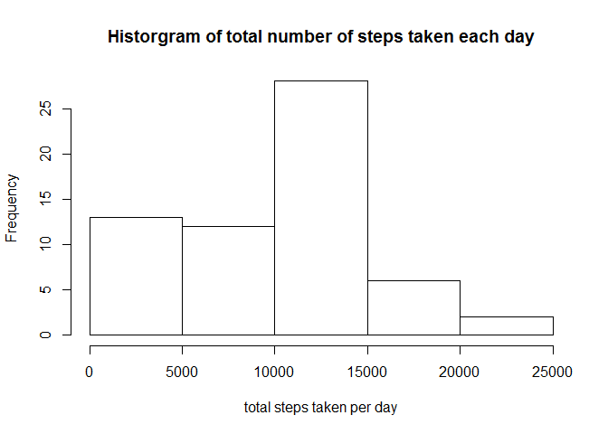
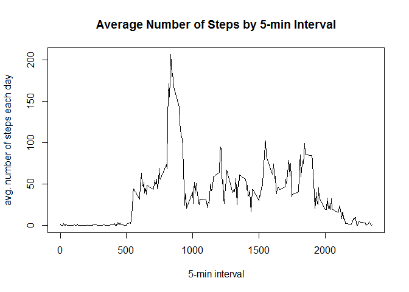

# Reproducible Research: Peer Assessment 1


## Loading and preprocessing the data

Read the orignial csv file into a data frame and load dplyr package for further analysis

```r
require(dplyr)
dfOrig <- read.csv("activity.csv", colClasses = c("integer", "Date", "integer"))
dfOrig <- tbl_df(dfOrig)
```

## What is mean total number of steps taken per day?

Calculate the total number of steps taken each day into a new data frame

```r
dfDay<- dfOrig %>% 
    group_by(date) %>% 
    summarize(totalSteps = sum(steps, na.rm = T))
```

Make a histogram

```r
hist(dfDay$totalSteps, 
     main = "Historgram of total number of steps taken each day",
     xlab = "total steps taken per day")
```

 

Calculate the mean and the median

```r
mean(dfDay$totalSteps)
```

```
## [1] 9354.23
```

```r
median(dfDay$totalSteps)
```

```
## [1] 10395
```

## What is the average daily activity pattern?

Calculate the average number of steps taken by 5-min interval into a new data frame

```r
dfInterval <- dfOrig %>% 
    group_by(interval) %>% 
    summarize(avgSteps = mean(steps, na.rm =T))                      
```

Make a time series plot

```r
with(dfInterval, plot(interval, avgSteps, 
                      type = "l",
                      main = "Average Number of Steps by 5-min Interval",
                      xlab = "5-min interval",
                      ylab = "avg. number of steps each day"))
```

 

Identify the top interval with highest average steps

```r
arrange(dfInterval, desc(avgSteps)) [1,]
```

```
## Source: local data frame [1 x 2]
## 
##   interval avgSteps
## 1      835 206.1698
```
It turns out to be the interval from 8h35 to 8h40.

## Imputing missing values

Find how many NA values that the dataset contains with summary function.

```r
summary(dfOrig)
```

```
##      steps             date               interval     
##  Min.   :  0.00   Min.   :2012-10-01   Min.   :   0.0  
##  1st Qu.:  0.00   1st Qu.:2012-10-16   1st Qu.: 588.8  
##  Median :  0.00   Median :2012-10-31   Median :1177.5  
##  Mean   : 37.38   Mean   :2012-10-31   Mean   :1177.5  
##  3rd Qu.: 12.00   3rd Qu.:2012-11-15   3rd Qu.:1766.2  
##  Max.   :806.00   Max.   :2012-11-30   Max.   :2355.0  
##  NA's   :2304
```
2304 rows contain missing values.

As one strategy for filling missing values, I plug in average steps for the 5-min interval as calculated above.  


## Are there differences in activity patterns between weekdays and weekends?
